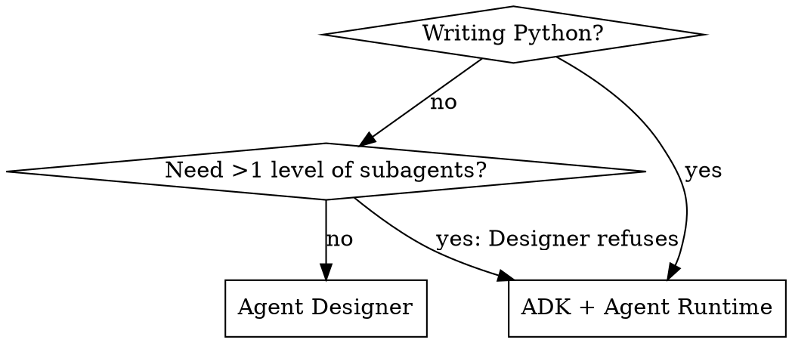

# Gemini Enterprise & Agent Platform

## Overview

Google renamed this whole surface in 2026 and moved the ADK docs to a new domain.
Model memory of it is **fluently wrong**: it emits real-looking URLs, real-looking API
fields, and real-looking product descriptions that are dead or invented.

**Core principle: never state a URL, product name, CLI flag, IAM role, or API field
for this platform from memory. Fetch it. Everything below carries a verification
date and method — treat an undated claim as unverified.**

Baseline evidence (n=2, ad-hoc, not a study): two no-tools agents asked these questions
on 2026-07-16 both cited `google.github.io/adk-docs` (dead — 301s away), one at 85%
self-rated confidence. One produced a complete registration REST payload in snake_case
(actual API is camelCase) while self-rating its doc-URL accuracy 35% — and shipped the
links anyway. Small sample; the failure mode is fluency, not ignorance.

Verified 2026-07-17. CLI facts checked against `google-adk==2.4.0` — **2.5.0 is already
out**; re-check the flag tables. See "Staleness" at the bottom.

## Naming (verified 2026-07-17)

Canonical mapping: https://docs.cloud.google.com/gemini-enterprise-agent-platform/vertex-ai-name-changes

| Previous | Current |
|---|---|
| Vertex AI Platform | Gemini Enterprise Agent Platform (GEAP) |
| Vertex AI | Agent Platform |
| **Vertex AI Studio** | **Agent Studio** |
| Vertex AI Search | Agent Search |
| Vertex AI API | Gemini Enterprise Agent Platform API |
| Agentspace | Gemini Enterprise (the end-user app) |

**The rebrand is cosmetic at the API layer.** Still `aiplatform.googleapis.com`, still
`ReasoningEngine`, still `roles/aiplatform.*`, still the `google-cloud-aiplatform` SDK.
Only docs and console naming moved.

Old `cloud.google.com/vertex-ai/*` URLs are **unreliable, not uniformly redirected**:
`/vertex-ai/docs/reasoning-engine/overview` **404s**, while
`/vertex-ai/generative-ai/docs/agent-engine/overview` returns 200 but lands on
`/gemini-enterprise-agent-platform/scale` — not a `/vertex-ai/*` path at all. Do not
assume an old link survives; check it.

### What each surface actually is

| Thing | What it is | What it is NOT |
|---|---|---|
| **Agent Studio** | Vertex AI Studio, renamed. A prompt/model workspace: refine system instructions, compare models side-by-side, prompt history, grounding. | **NOT an agent builder. NOT a deploy target.** Its docs page has zero mentions of ADK. Marketing calling it "a low-code canvas for agent reasoning loops" is unsupported by the docs. |
| **Agent Designer** | No-code/low-code builder **inside Gemini Enterprise**. Chat pane + Flow canvas, Schedule tab, Preview tab. | Not part of Agent Platform. Not where Python runs. |
| **Agent Runtime** | Managed runtime for deployed agents. API resource is `reasoningEngines/<id>`. | — |
| **ADK** (`google-adk`) | Python framework for code-first agents. | Not a runtime. |

**"Agent Engine" vs "Agent Runtime":** same thing, mid-rename. `/build/runtime` says
only *"Because the name of Agent Runtime changed over time, the name of the resource in
the API reference is `ReasoningEngine`."* The exact Engine→Runtime mapping is
**NOT DOCUMENTED**; both names are live in Google's own tables. Do not claim they are
different products.

## Verified links (fetched 2026-07-17)

| Topic | URL |
|---|---|
| GEAP docs root | https://docs.cloud.google.com/gemini-enterprise-agent-platform |
| **Vertex AI name changes** | https://docs.cloud.google.com/gemini-enterprise-agent-platform/vertex-ai-name-changes |
| Agent Runtime overview | https://docs.cloud.google.com/gemini-enterprise-agent-platform/build/runtime |
| Runtime setup (APIs + IAM) | https://docs.cloud.google.com/gemini-enterprise-agent-platform/build/runtime/setup |
| Deploy an agent | https://docs.cloud.google.com/gemini-enterprise-agent-platform/scale/runtime/deploy-an-agent |
| Quotas | https://docs.cloud.google.com/gemini-enterprise-agent-platform/resources/agent-quotas |
| Scaling / concurrency | https://docs.cloud.google.com/gemini-enterprise-agent-platform/scale/runtime/optimize-and-scale |
| Agent Studio | https://docs.cloud.google.com/gemini-enterprise-agent-platform/agent-studio |
| Sessions | https://docs.cloud.google.com/gemini-enterprise-agent-platform/scale/sessions |
| Memory Bank | https://docs.cloud.google.com/gemini-enterprise-agent-platform/scale/memory-bank |
| Tracing / Logging / Monitoring | .../scale/runtime/tracing · /logging · /monitoring |
| Register an ADK agent | https://docs.cloud.google.com/gemini/enterprise/docs/register-and-manage-an-adk-agent |
| Register an A2A agent | https://docs.cloud.google.com/gemini/enterprise/docs/register-and-manage-an-a2a-agent |
| Agent Designer | https://docs.cloud.google.com/gemini/enterprise/docs/agent-designer |
| ADK docs root | https://adk.dev/ |
| ADK get started | https://adk.dev/get-started/python/ |
| ADK workflows / multi-agent | https://adk.dev/workflows/ |
| ADK custom tools | https://adk.dev/tools-custom/ |
| ADK deploy to Agent Runtime | https://adk.dev/deploy/agent-runtime/ |
| ADK sessions & memory | https://adk.dev/sessions/ |
| register-gemini-enterprise CLI | https://googlecloudplatform.github.io/agent-starter-pack/cli/register_gemini_enterprise.html |

### Dead, stub, and trap URLs

- `google.github.io/adk-docs/*` — 301s to adk.dev. **Models cite this at 85% confidence.**
- `adk.dev/deploy/agent-engine/` → stub. Use `/deploy/agent-runtime/`.
- `adk.dev/tools/` → stub. Use `/tools-custom/` or `/integrations/`.
- `adk.dev/get-started/quickstart/` → stub. Use `/get-started/python/`.
- `.../scale/runtime/quotas` → **404**. Quotas live at `/resources/agent-quotas`.
- Doc tree is split: `/build/runtime/*` (setup, create) vs `/scale/runtime/*` (deploy,
  manage, observability). Easy to mis-cite; the pages cross-link between the two.

## Two verification traps

**1. The stub trap.** adk.dev serves client-side redirect stubs that return **HTTP 200**
with a ~450-byte body. Status code alone will fool you.

```bash
curl -sL https://adk.dev/deploy/agent-engine/  | wc -c   # stub: ~450
curl -sL https://adk.dev/deploy/agent-runtime/ | wc -c   # not a stub: ~110000
```

**Byte size only detects stubs. It does not mean the page has what you need** — that
110KB page is ~11KB of text, mostly nav and an MIT licence, and contains **zero**
occurrences of `adk deploy` or `agent_engine`. Always grep for the actual string:

```bash
curl -sL URL | grep -c 'the_thing_you_need'   # 0 = page won't help, whatever its size
```

**2. The devsite table trap.** WebFetch's HTML→markdown conversion **silently drops
table content** on Google devsite pages (quotas, IAM roles, the rename map) and returns
nav-only text. The tables ARE in raw HTML — `curl` + regex extracts them fine, so the
cause is the converter, not JavaScript. Remedy: fetch raw HTML and read the table
yourself rather than trusting a summary of it.

Once, a summarizer pass over the deploy page **invented a plausible IAM role list**
including `roles/aiplatform.admin`, which appears nowhere in that page's HTML (observed
2026-07-17, once, not reproduced on retry). Treat it as a real if intermittent risk:
a confident answer about a devsite table you only saw through a summarizer is worth
re-checking against raw HTML.

## Which surface to use



Agent Studio is on neither branch — it is a prompting workspace, not a build target.

**Agent Designer nesting limit — one level.** Source: observed refusal from the builder
itself (2026-07-16), message: *"the system only supports a single level of subagents."*
**NOT DOCUMENTED** on any Google page found. Treat as empirical, re-test before relying.
ADK has no such limit. Before rewriting in Python for this reason alone: flattening the
graph into one orchestrator is usually an equivalent design.

## Deploy & register

Full detail — prerequisites, deprecated flags, REST payload, CLI situation:
**read `references/deploy-and-register.md`.**

Short version:

```bash
gcloud services enable aiplatform.googleapis.com storage.googleapis.com \
  logging.googleapis.com monitoring.googleapis.com cloudtrace.googleapis.com \
  telemetry.googleapis.com cloudresourcemanager.googleapis.com discoveryengine.googleapis.com
gcloud projects add-iam-policy-binding PROJECT_ID \
  --member=user:YOU@example.com --role=roles/aiplatform.user

adk deploy agent_engine --project=P --region=us-central1 \
  --display_name="My Agent" ./my_agent
# -> projects/P/locations/us-central1/reasoningEngines/RESOURCE_ID
```

Then Console: Gemini Enterprise → app → **Agents** → **Add agent** → **Custom agent via
Agent Platform** → paste the resource path. (Registration needs a Gemini Enterprise app
to already exist — creating one is **not covered by this skill**.)

Do not hand-roll `vertexai.agent_engines.create(...)`. The CLI reads `.env` and
`requirements.txt` from the agent folder already.

⚠️ **Deploy has two competing paths and Google recommends the other one.**
`adk deploy agent_engine` is verified to exist (`--help`, ADK 2.4.0) but appears
**nowhere** on `adk.dev/deploy/agent-runtime/`; that page and `/build/runtime` both
point at the **Agents CLI** instead. Separately, the official ADK + agents-cli
quickstart deploys to **Cloud Run, not Agent Runtime** (`--deployment-target cloud_run`).
Decide deliberately; do not assume the blessed path lands on Agent Runtime.

**Teardown** — 100 resources is the cap, and stranded runtimes count against it:

```bash
gcloud beta ai reasoning-engines list   --region=us-central1 --project=PROJECT_ID
gcloud beta ai reasoning-engines delete RESOURCE_ID --region=us-central1 --project=PROJECT_ID
```

## Limits that bite (verified 2026-07-17)

| Quota (per project, per region) | Default |
|---|---|
| Agent Platform resources | **100** |
| Query / StreamQuery per minute | **90** |
| Concurrent BidiStreamQuery connections | 10 |
| Create/delete/update resources per minute | 10 |
| Memory Bank write / read per minute | 100 / 300 |

Source: /resources/agent-quotas, raw HTML, 2026-07-17. **Express mode is ~10x tighter**
(10 resources, 10 QPM, 1 concurrent bidi) — a separate table on the same page.

90 QPM is low enough that real workloads hit `429 Resource Exhausted`. Request quota early.

Per /scale/runtime/optimize-and-scale (2026-07-17): `container_concurrency` defaults to
**9**, docs recommend multiples of 9 (e.g. 36) for async/ADK agents; cold start ~4.7s at
`min_instances=1`, ~1.4s at 10, warm ~0.4s.

## State: three different things

- **Session State** — temporary, current conversation only.
- **Sessions** — the event log (messages, function calls). ADK manages automatically.
- **Memory Bank** — distils durable facts across sessions, per-user, similarity search, TTL.

**None of these is a dedupe ledger.** Agent Runtime has **no persistent disk** — a JSON
file a tool writes vanishes between runs, silently, and the agent repeats its work
forever. For "what have I already processed," use GCS or Firestore explicitly, and grant
the runtime's service account access to it.

## A2UI — agent-drawn widgets in the GE chat surface

Full detail — wire format, both build paths, the runtime blockers:
**read `references/a2ui.md`.**

The two facts that change your plan before you write anything:

**1. A2UI renders only for agents registered via `a2aAgentDefinition`.** An agent
deployed to Agent Runtime and registered via `adkAgentDefinition` will not render
it. So "add A2UI to our deployed agent" is a runtime migration to a self-hosted
A2A endpoint, not a UI task — and it inherits everything the managed runtime did
for you: `to_a2a()` silently swaps persistent sessions and Memory Bank for
in-memory stand-ins, and the end user's identity for a per-conversation
`A2A_USER_*` sentinel.

**2. Gemini Enterprise supports v0.8 only**, and identifies the payload by
`mimeType: application/json+a2ui` on the DataPart metadata. The newer
`application/a2ui+json` spelling is v0.9+ and will not render there.

Two ways to build, and they are genuinely different architectures:

| | Path A: convert a deployed ADK agent | Path B: A2UI agent from scratch |
|---|---|---|
| Who composes the UI | your code, from session state | the model, from a generated system prompt |
| Serving | `to_a2a()` + an `after_agent_callback` emitting DataParts | custom `AgentExecutor`, per Google's own sample |
| Needs | nothing beyond ADK | `pip install a2ui-agent-sdk` |
| Can invent facts | no — a value not in state cannot be drawn | yes — every widget is model output |
| Use when | the data is already structured | the UI must adapt to open-ended requests |

Google's reference implementation for Path B is
`samples/community/agent/adk/gemini_enterprise/v0_8/` in `github.com/google/a2ui`
(`agent_engine/` and `cloud_run/` variants). Read it before writing an executor.

Get the wire format from the v0.8 renderer fixtures, not from memory:

```bash
gh api repos/google/a2ui/contents/renderers/angular/src/v0_8/test_data/mocks/contact-card.json \
  --jq '.content' | base64 -d
```

A card that fails to render shows a red **"This content could not be displayed"**
box in the chat with a short fragment naming the offending component id — and
logs nothing server-side. That box is the only debugging signal GE gives you.

⚠️ **`output_schema` and `google_search` cannot coexist.** Gemini returns
`400 INVALID_ARGUMENT: controlled generation is not supported with Search tool`,
whatever ADK's `output_schema` docstring says about schema and tools composing.
To get structured data out of a search agent, split it: search agent (built-in,
prose) → structuring agent (no tools, `output_schema`), wrapped in a
`SequentialAgent`. This also keeps the one-built-in-per-agent rule intact.

## Runtime behaviour — measured end-to-end (2026-07-22)

Everything in this section was **observed against a live deployed ADK agent registered
in a real Gemini Enterprise app**, not read from docs. Google documents almost none of
it. Method: deploy a probe agent whose only tool dumps `list_artifacts()`,
`user_content.parts`, `user_id`, `session_id`, then read the session event log via
`agent_engines.get(...).get_session(...)`. Verified on `google-adk==2.4.0`.

### File upload DOES reach a custom agent — as an artifact, with empty text markers

The registration doc contains **zero** occurrences of `upload`, `artifact`,
`multimodal`, or `pdf`, and every doc describing file upload talks about "the
assistant". It works anyway. A user attaching `resume.pdf` produces:

```
message parts (all type text, NO inline_data):
  "run the probe"
  "\n<start_of_user_uploaded_file: resume.pdf>"
  "<end_of_user_uploaded_file: resume.pdf>\n"

list_artifacts() -> ["resume.pdf"]
```

**There is nothing between the start and end markers.** GE announces the file and names
it; the bytes go only to the artifact service.

**Consequence:** an agent must hold `LoadArtifactsTool`
(`google.adk.tools.load_artifacts_tool`) or it can never read the file. The failure mode
is nasty — the model sees a marker naming a document it cannot open, and typically
**invents** the contents rather than erroring. Instruct it to call `load_artifacts` on
the marker filename and to say so if the load fails.

Use the **marker filename** to detect "a file was attached this turn". Do **not** use
`list_artifacts()` for that — artifacts persist for the whole session, so a later turn
with no attachment still lists earlier files. (That persistence is useful: the user
uploads once per conversation, not once per message.)

### GE passes a real `user_id` and a stable `session_id`

- `user_id` is the end user's **email** (e.g. `someone@example.com`), not the
  `default-user-id` fallback at `templates/adk.py:102`.
- Two turns in one conversation reused **one** session id; `list_sessions(user_id=...)`
  returned exactly one session, event count grew 2 → 6.

So `output_key` + `{key?}` instruction templating **does** work across turns in
production. Design for that; still confirm on first deploy of a real agent, because a
probe that never writes state cannot prove state survives.

### Missing `session_id` crashes the deployed template, silently

`streaming_agent_run_with_events` without `session_id` takes a branch that reaches for
an uninitialised service:

```
templates/adk.py:1367 -> :793 _init_session
AttributeError: 'NoneType' object has no attribute 'create_session'
```

The client sees an **empty stream and no exception**. GE always sends a session id, so
this is mainly a trap when calling the method yourself: create a session first
(`agent.create_session(user_id=...)`) and pass its id. **Any "the agent returned
nothing" symptom: read Cloud Logging before believing the agent ran.**

### An empty final answer looks identical to a crash

Observed repeatedly: the model calls its tool, the tool returns correct data, and the
final event is `{"text": ""}` with `finishReason: STOP`. The GE UI renders a **blank
reply** while the session log holds the full result. Always confirm via session events:

```python
s = agent.get_session(user_id=UID, session_id=SID)
for e in s["events"]:
    for p in (e.get("content") or {}).get("parts") or []:
        if p.get("functionResponse"): print(p["functionResponse"]["response"])
```

Instruct agents to always emit a user-facing summary after tool calls.

**A `429 RESOURCE_EXHAUSTED` also surfaces as an empty reply.** Observed while testing:
tool calls ran, then the turn ended with no text. The 429 appeared only in the session
event's `errorMessage` field, not in the client stream. So a blank answer has at least
three causes — model returned empty, server crashed, quota exhausted — and they are
indistinguishable without reading `errorMessage` on the session events:

```python
for e in agent.get_session(user_id=UID, session_id=SID)["events"]:
    if e.get("errorMessage"): print(e["errorMessage"])
```

Note ADK's own 429 message points at `google.github.io/adk-docs/...`, the **dead** domain
this skill warns about — do not follow it.

**Memory Bank writes are asynchronous.** A new session opened seconds after the one that
produced a memory will not see it: generation is LLM-distillation running in the
background. Measured lag of roughly a minute between the turn and the memory's
`createTime`. Do not test cross-session recall with back-to-back sessions and conclude
the wiring is broken — check the memories REST endpoint first:

```
GET https://us-central1-aiplatform.googleapis.com/v1beta1/projects/P/locations/L/reasoningEngines/ID/memories
```

### Registering an agent does not make it visible

Registration succeeds and reports `"state": "ENABLED"`, but the agent does **not** appear
in the Gemini Enterprise web app until it is **shared**. Sharing is
**console-only** — `share-custom-agents` documents no REST/curl path:
app → **Agents** → agent display name → **User permissions** → **Add user**
(member type User/Group/Principal/Workforce pool/All users). End users additionally need
the **Discovery Engine User** IAM role.

The console button is labelled **"Custom agent via Agent Runtime"**.

### Both discoveryengine endpoint spellings work — so you can create duplicates

`global-discoveryengine.googleapis.com` and plain `discoveryengine.googleapis.com` both
accepted the same registration POST and each created a **separate agent**. Do not write
a "try endpoint A, fall back to B" loop; it silently double-registers. Delete extras via
`DELETE .../agents/AGENT_ID`.

Also: with user ADC, discoveryengine calls need `-H "X-Goog-User-Project: PROJECT_ID"`
or they fail 403 `SERVICE_DISABLED` complaining about a missing quota project.

### `adk deploy agent_engine` DOES have service flags

Contradicts a plausible-sounding claim that it has none. Verified via `--help` on 2.4.0
(the deploy doc page never mentions this command at all, so `--help` is the only source):

| Flag | Values |
|---|---|
| `--artifact_service_uri` | `gs://<bucket>`, `memory://`, `file://<path>` |
| `--memory_service_uri` | `agentengine://<id>`, `rag://<corpus>`, `memory://` |
| `--session_service_uri` | explicit URI |
| `--use_local_storage` | cannot be combined with explicit service URIs |

Deployed default artifact service is `InMemoryArtifactService`
(`templates/adk.py:1003-1007`). `--use_local_storage` help warns that when the agents
directory isn't writable — *"common in Cloud Run/Kubernetes"* — ADK **silently** falls
back to in-memory. Set URIs explicitly.

### Built-in tools: ADK does not validate, it silently rewrites

A Gemini built-in (`google_search`, `url_context`) cannot share an `LlmAgent` with custom
function tools — **enforced by the Gemini API, not by ADK**:

- `llm_agent.py:139-176` auto-wraps `google_search` in an `AgentTool` when multiple tools
  are present, with `TODO(b/448114567)` — it raises nothing.
- That workaround is **opt-in and off**: `google_search_tool.py:43`
  `bypass_multi_tools_limit: bool = False`, and the module singleton uses defaults.
- **`url_context` has no workaround at all** — no bypass flag, no agent wrapper.

Google's own code shows the intended shape
(`adk/cli/built_in_agents/adk_agent_builder_assistant.py:89`): *"ADK's built-in tools
(google_search, url_context) are designed as agents"* — one built-in per leaf agent,
reached via `AgentTool`. Assert this statically in tests; it otherwise fails only at
the API, possibly only in production.

### AgentTool forwards state and artifacts, but NOT memory

Read `google/adk/tools/agent_tool.py:248-285` before designing any orchestrator that
delegates. Each `AgentTool` call builds a **nested `Runner`** for the sub-agent:

| Service | What the sub-agent gets | Consequence |
|---|---|---|
| `artifact_service` | `ForwardingArtifactService(tool_context)` (`:251`) | sub-agents **can** read uploaded files |
| `session_service` | fresh `InMemorySessionService()` (`:252`) — but parent state is **copied in** via `state=state_dict` (`:264-272`), and `state_delta` is **forwarded back** (`:283-285`) | `output_key` + `{key?}` templating **work in both directions** |
| `memory_service` | **fresh empty `InMemoryMemoryService()`** (`:253`) | `tool_context.search_memory()` inside any sub-agent **always returns nothing** |

The memory row is the trap. It fails **silently** — an empty result, not an error — so a
tool that looks up history in a sub-agent returns "no records" and the agent confidently
tells the user they have none. Observed exactly that: a student's tracked application was
correctly stored in Memory Bank, and the tracker specialist still reported "you haven't
tracked any applications yet".

**Design rule:** only the **root** can see memory. Put `PreloadMemoryTool` there, and
instruct the root to *restate* recalled facts inside the request text it sends to a
specialist. Do not give a sub-agent a tool that calls `search_memory` — it cannot work.

### Nothing writes to Memory Bank for you

Deploying with `--memory_service_uri agentengine://<id>` wires the service up but writes
nothing. Gemini Enterprise calls the agent and walks away; session state then dies with
the session. Memories appear only when something calls `add_session_to_memory`.

The documented hook (`Context.add_session_to_memory` docstring) is an after-agent
callback:

```python
async def remember_session(callback_context):
    try:
        await callback_context.add_session_to_memory()
    except Exception:
        logger.warning("could not persist session", exc_info=True)  # best-effort

root_agent = Agent(..., after_agent_callback=remember_session)
```

Verified working: Memory Bank distilled *"I applied for a Backend Engineer Intern
position at Stripe … status 'Applied'"* scoped to `{app_name, user_id}` with no manual
call. Generation is LLM-distillation, so what comes back is a **natural-language fact**,
not the structured row your tool stored — reconcile, don't assume round-tripping.

### Minor API notes (ADK 2.4.0)

- `ToolContext` is an alias for a unified `Context` (`tools/tool_context.py:25`).
  `ctx.list_artifacts()` / `load_artifact()` / `save_artifact()` are async and raise
  `ValueError` when no artifact service exists. `ctx.user_content`, `ctx.user_id`,
  `ctx.session` come from `ReadonlyContext`.
- `agent.streaming_agent_run_with_events(...)` is an **async generator** — `async for`,
  not `for`. Iterating it synchronously raises
  `TypeError: 'async_generator' object is not iterable`.
- `agent.operation_schemas()` shows each method's registered `api_mode`
  (`stream`, `async_stream`, …) — useful for confirming a deploy registered what you
  expect.

## Common mistakes

| Mistake | Reality |
|---|---|
| "GE file upload doesn't reach custom agents" | It does — as an artifact plus empty text markers. Needs `LoadArtifactsTool`. |
| Adding A2UI to an agent registered via `adkAgentDefinition` | It will never render. A2UI needs the `a2aAgentDefinition` path — that is a runtime migration, not a UI change. |
| `output_schema` on an agent holding `google_search` | Gemini 400s: controlled generation is unsupported with the Search tool. Split search and structuring into two agents. |
| Emitting `application/a2ui+json` for Gemini Enterprise | That is the v0.9+ spelling. GE is v0.8 and wants `application/json+a2ui`. |
| Handing `to_a2a` an agent card file path | It uses the card verbatim; `host`/`port`/`protocol` are then dead, and the card advertises whatever `url` is on disk. Build the card in code. |
| Trusting `google-adk[a2a]` to install the A2A server | It omits `a2a-sdk[http-server]`; `sse-starlette` is missing and the failure surfaces only at container start. |
| `dict(callback_context.state)` | Raises `KeyError: 0` — `State` has no `keys()`. Use `.get()`. |
| Naming an A2UI component `body` (or `root`, `title`) | GE's validator refuses the card with a red "This content could not be displayed" box. `body` is also a `Text.usageHint` value; the official fixture calls that node `main-column`. Namespace ids per surface. |
| Expecting GE to tell the A2A agent who the user is | It does not — no identity header, no message metadata, no authenticated principal. Only the Discovery Engine service agent, which is the same for everyone. |
| Giving a sub-agent a tool that calls `search_memory` | `AgentTool` hands it an empty `InMemoryMemoryService`. Silently returns nothing. Only the root sees memory. |
| Assuming `--memory_service_uri` makes memories appear | It only wires the service. Something must call `add_session_to_memory` — use an after-agent callback. |
| "The agent returned nothing, so it's broken" | Could be an empty final text, or a server crash. Read session events / Cloud Logging. |
| Registering an agent, then expecting to see it | Registration ≠ visibility. Share it (console only). |
| Endpoint fallback loop for discoveryengine | Both spellings work → duplicate agents. |
| Citing `google.github.io/adk-docs` | 301s to adk.dev. |
| "It returned 200, so the URL is good" | Stubs return 200 at ~450 bytes. |
| Trusting a summarized devsite table | JS-rendered; summarizers fabricate. Read raw HTML. |
| "Agent Studio is the no-code agent builder" | It is Vertex AI Studio renamed — a prompt workspace. |
| "Agent Engine and Agent Runtime differ" | Same thing, mid-rename. |
| `roles/aiplatform.admin` for deploy | Documented role is **`roles/aiplatform.user`**. |
| Recalling the registration payload | `v1alpha`, camelCase, churning. Fetch it. |
| Custom deploy script | `adk deploy agent_engine` already does it. |
| Local JSON file for agent memory | No persistent disk. GCS/Firestore. |

## Rationalizations

| Excuse | Reality |
|---|---|
| "I know the ADK docs URL" | Baselines rated it 85%. It was wrong. |
| "The URL pattern is obvious from how Google structures docs" | Pattern-matching, not knowledge. Self-rated 35% accurate; shipped anyway. |
| "Just a naming detail" | The name determines the URL, the CLI, and the API resource. |
| "The official doc says use X CLI" | The official ADK page points at the wrong CLI for registration. |
| "My cutoff is recent enough" | Renamed in 2026; ADK changed domains. Cutoff does not help. |
| "The search result said so" | Marketing copy contradicts the docs on Agent Studio. Prefer the doc page. |

## Red flags — STOP and fetch

- About to type a `cloud.google.com/vertex-ai/...` path for agents
- About to write an API payload or IAM role from memory
- About to describe what Agent Studio does
- About to claim a CLI exists without finding its install docs
- Quoting a devsite table you only saw through a summarizer
- Confidence high, string must be exact
- About to write an A2UI component tree from memory instead of reading the v0.8 fixtures
- About to claim a widget "renders in GE" when you have only seen the payload on the wire

## Staleness

Verified 2026-07-17. This surface renamed once in 2026 and the ADK docs moved domains;
the rebrand date itself is **NOT DOCUMENTED** by Google.

The **Runtime behaviour** section (2026-07-22) is the most durable part of this skill —
it was measured against a live deployed agent rather than read, so it does not rot when
docs move. Re-verify it only if `google-adk` majors or the GE chat surface changes.

| Claim class | Verified how | Re-check with |
|---|---|---|
| GE upload / markers / session reuse | **live probe agent + session event log, 2026-07-22** | redeploy a probe; read `get_session(...)["events"]` |
| URLs / stubs | fetched | `curl -sL URL \| wc -c`, then grep the string you need |
| Quotas, IAM, rename map | raw HTML | `curl` + read the table — not a summarizer |
| CLI flags, precedence, folder layout | **executed `--help` + read `cli_deploy.py` source** | `adk deploy agent_engine --help` |
| Registration REST payload | doc page, `v1alpha` | fetch the page; expect churn |
| Agent Designer nesting limit | **observed builder refusal, NOT DOCUMENTED** | re-test in the UI |
| A2UI: registration path, v0.8-only, mime | GE docs + `a2ui/a2a/parts.py` source, 2026-07-28 | refetch the a2ui-agents doc pages |
| A2UI: wire format and catalog | v0.8 renderer fixtures in `google/a2ui` | `gh api` the mocks directory |
| A2UI: DataPart emission, `output_schema`+Search 400, missing `sse-starlette` | **live Cloud Run service + live Gemini API errors, 2026-07-28** | redeploy and POST `message/send` |
| **A2UI actually painting in the GE app** | **NOT VERIFIED — payload only** | open the GE web app and look |

⚠️ The CLI table is the least independently checkable section here: it requires
`google-adk` installed, has **no doc page as a second source** (the page that should
document it doesn't mention the command), and was verified on **2.4.0 when 2.5.0 is
already released**. Re-run `--help` before trusting it.

Anything without a verification date, or marked NOT DOCUMENTED, is not a fact.

## Project context

Stored working data for this user: `references/project-context.md`
